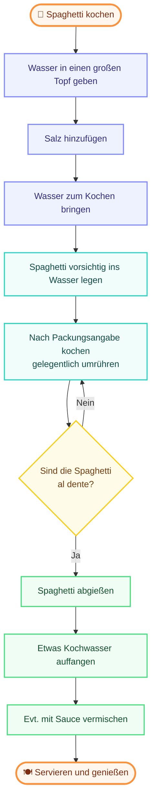

# M231

## Tag 2

### Was habe ich heute gemacht?
Heute haben wir einen **Quiz** über die letzte Woche gemacht.  
Danach erstellten wir in einer Gruppe eine Tabelle zum **Spaghetti kochen** und benutzen **Mermaid.live** um ein Diagramm zu erstellen.  
Zum Schluss lernten wir etwas über **Datenschutzgesetz** in der EU und der Schweiz.  
Danach mussten wir in den gleichen Gruppen eine **PPT** darüber machen.

---

### Notizen zum revidierten Datenschutzgesetz (revDSG) (Notizen von anderen PPT's)

#### Die 5 Grundsätze:
1. **Rechtmässigkeit:** Ohne Einwilligung Daten nicht an dritte Personen abgeben, ausser es liegen rechtliche Gründe vor.
2. **Verhältnismässigkeit:** Daten nur so lange behalten, wie man sie braucht. Danach müssen sie gelöscht werden.
3. **Zweckbindung:** Die Person muss wissen, wieso man ihre Daten braucht.
4. **Richtigkeit:** Die Daten müssen richtig und aktuell (neu) sein.
5. **Datensicherheit:** Die Daten müssen gut gesichert sein.

#### Schutz der Personendaten:
*   **Öffentliche Daten:** z. B. Namen
*   **Interne Daten:** z. B. Handyfotos
*   **Vertrauliche Daten:** z. B. Lohnangaben und Krankheitsdaten
*   **Geheime Daten:** z. B. Passwörter

#### Wenn das Gesetz gebrochen wird (Konsequenzen):
*   **Geldbusse:** Bis zu 250'000 CHF
*   **Firmenbusse:** Bis zu 50'000 CHF
*   **Haftstrafe**
*   **Schadenersatz**

Code:

