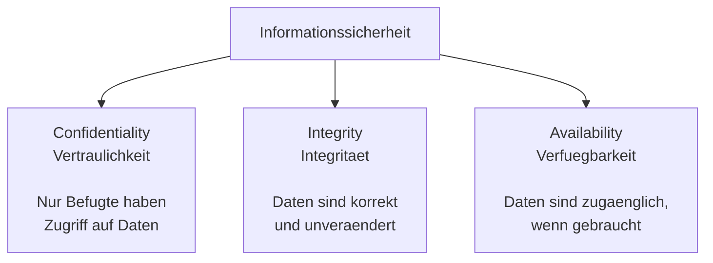
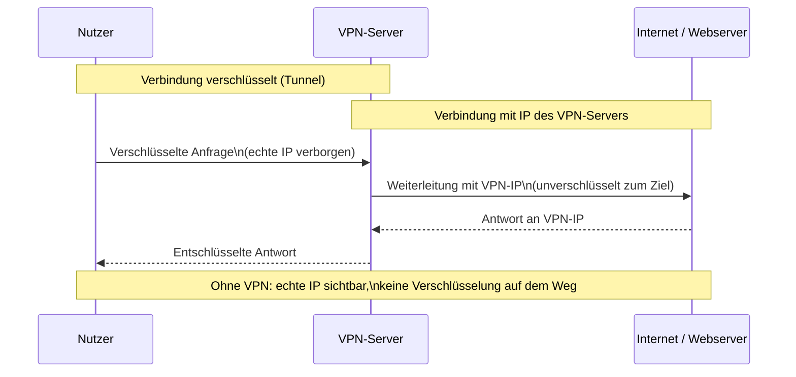
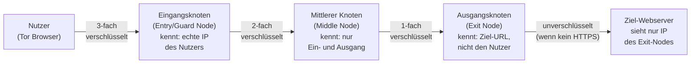

# M231 Lernjournal
### Ylli Uka
### PE26a
 
### 24.08.26
---
## 1. CIA-Triade – Schutzziele der Informationssicherheit
 

| Nr. | Situation | Betroffenes CIA-Ziel |
| :--- | :--- | :--- |
| **1** | Ein Ransomware-Angriff verschlüsselt alle Dateien eines Spitals. |Verfügbarkeit|
| **2** | Ein Praktikant liest heimlich Personalakten von Kolleg:innen. |Vertraulichkeit |
| **3** | Auf einer Webseite werden Preise durch eine Sicherheitslücke unbemerkt verändert. |Integrität |
| **4** | Ein DDoS-Angriff legt einen Online-Shop für Stunden lahm. | Verfügbarkeit|

 
 
---
 ## 2. Datenschutz vs. Datensicherheit
 
| Nr. | Situation | Ihre Einschätzung | Begründung |
| :--- | :--- | :--- | :--- |
| **1** | Ein Mitarbeiter notiert Passwörter auf einem Post-it am Monitor. | **Datensicherheit** | Das Passwort liegt offen rum. Jeder kann sich einfach einloggen. |
| **2** | Eine Firma gibt Mitarbeiterdaten ohne Einwilligung an Headhunter weiter. | **Datenschutz** | Private Daten werden einfach ohne Erlaubnis weitergegeben. |
| **3** | Ein Server wird nicht regelmässig gesichert (kein Backup). | **Datensicherheit** | Ohne Backup sind die Daten bei einem Absturz komplett weg. |
| **4** | Eine App fragt beim Signup nach Geburtsdatum, braucht es aber nicht. | **Datenschutz** | Unnötige Datenabfrage verstösst gegen das Prinzip der Datenminimierung. |
| **5** | Die Firewall eines Unternehmens ist falsch konfiguriert und lässt Angriffe durch. | **Datensicherheit** | Ein technischer Fehler, der das Netzwerk ungeschützt lässt. |

## 3. Diskussionsaufgabe: Krankenhaus-Szenario

*Ein Krankenhaus speichert Patientendaten unverschlüsselt auf einem freigegebenen Netzlaufwerk.*

### Welches Prinzip wird verletzt?
Es werden **beide** Prinzipien verletzt:
* **Datensicherheit:** Die unverschlüsselte Speicherung auf einem öffentlichen Laufwerk ohne Zugriffskontrollen bricht das Schutzziel der **Vertraulichkeit (Confidentiality)**.
* **Datenschutz:** Patientendaten sind rechtlich gesehen **besonders schützenswerte Personendaten** (Gesundheitsdaten). Das Krankenhaus verletzt hier massiv seine gesetzliche Sorgfaltspflicht zum Schutz dieser Daten vor unbefugtem Zugriff.

### Welche Konsequenzen können entstehen?
* **Datenabfluss & Erpressung:** Angreifer oder unbefugte Dritte können die sensiblen Patientendaten kopieren, stehlen und das Spital erpressen (Ransomware/Doxxing).
* **Rechtliche und finanzielle Folgen:** Es drohen massive Bussgelder (bis zu **CHF 250'000.-** bei vorsätzlicher Pflichtverletzung nach dem Schweizer revDSG).
* **Gesetzliche Meldepflicht:** Es muss zwingend eine unverzügliche Meldung der Datenpanne an den **EDÖB** (Eidgenössischer Datenschutz- und Öffentlichkeitsbeauftragter) erfolgen.
* **Imageschaden:** Ein massiver und irreparabler Vertrauensverlust bei den Patienten und in der Öffentlichkeit.

## 4. Transferaufgabe: Datenschutz-Check (Online-Anonymität)

Ich habe meinen eigenen Browser auf **coveryourtracks.eff.org** getestet. Hier sind meine echten Ergebnisse mit dem Brave-Browser:

* **Verwendeter Browser:** Brave
* **Schutz vor Tracking-Cookies (Web-Tracking):** **Ja** (Erfolgreich blockiert)
* **Schutz vor Invisible Trackers (unsichtbare Tracker):** **Ja** (Erfolgreich blockiert)
* **Schutz vor Browser-Fingerprinting:** **Stark geschützt** (Mein Browser nutzt einen zufälligen Fingerabdruck / randomized fingerprint)

### Erklärung:
Brave schützt mich im Internet sehr gut. Der Test zeigt, dass Tracker und Werbung blockiert werden. 
Besonders stark ist der **zufällige Fingerabdruck (randomized fingerprint)**: Brave verändert meine Browser-Daten bei jedem Seitenaufruf ganz leicht. Für Tracker sehe ich deshalb jedes Mal wie ein völlig neuer Besucher aus. Sie können mich also nicht wiedererkennen oder ein Profil über mich erstellen.

### Fazit:

| Datenspur | Wer sieht es? |
|---|---|
| IP-Adresse | Webserver, ISP, Behörden |
| Browser-Fingerprint | Webserver, Werbenetze |
| Cookies | Webseite, Drittanbieter |
| DNS-Anfragen | ISP, DNS-Provider |
| Metadaten (Zeit, Ort) | Viele Beteiligte |

  
