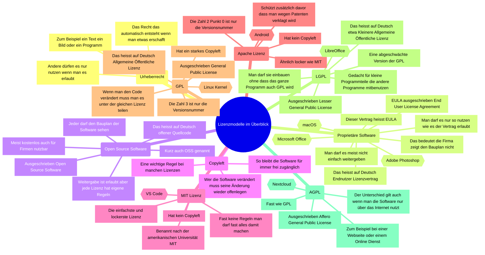

# M231 Lernjournal
### Ylli Uka
### PE26a
#### Tag 4
### 07.09.26
---

```mermaid 
mindmap
  root((Lizenzmodelle im Überblick))
    (Urheberrecht)
      [Das Recht das automatisch entsteht wenn man etwas erschafft]
      [Zum Beispiel ein Text ein Bild oder ein Programm]
      [Andere dürfen es nur nutzen wenn man es erlaubt]
    (Proprietäre Software)
      [Das bedeutet die Firma zeigt den Bauplan nicht]
      [Man darf es nur so nutzen wie es der Vertrag erlaubt]
      [Dieser Vertrag heisst EULA]
      [EULA ausgeschrieben End User License Agreement]
      [Das heisst auf Deutsch Endnutzer Lizenzvertrag]
      [Man darf es meist nicht einfach weitergeben]
      {{Microsoft Office}}
      {{Adobe Photoshop}}
      {{macOS}}
    (Open Source Software)
      [Kurz auch OSS genannt]
      [Ausgeschrieben Open Source Software]
      [Das heisst auf Deutsch offener Quellcode]
      [Jeder darf den Bauplan der Software sehen]
      [Meist kostenlos auch für Firmen nutzbar]
      [Weitergabe ist erlaubt aber jede Lizenz hat eigene Regeln]
    (Copyleft)
      [Eine wichtige Regel bei manchen Lizenzen]
      [Wer die Software verändert muss seine Änderung wieder offenlegen]
      [So bleibt die Software für immer frei zugänglich]
    (MIT Lizenz)
      [Benannt nach der amerikanischen Universität MIT]
      [Die einfachste und lockerste Lizenz]
      [Fast keine Regeln man darf fast alles damit machen]
      [Hat kein Copyleft]
      {{VS Code}}
    (Apache Lizenz)
      [Die Zahl 2 Punkt 0 ist nur die Versionsnummer]
      [Ähnlich locker wie MIT]
      [Hat kein Copyleft]
      [Schützt zusätzlich davor dass man wegen Patenten verklagt wird]
      {{Android}}
    (GPL)
      [Ausgeschrieben General Public License]
      [Das heisst auf Deutsch Allgemeine Öffentliche Lizenz]
      [Die Zahl 3 ist nur die Versionsnummer]
      [Hat ein starkes Copyleft]
      [Wenn man den Code verändert muss man es unter der gleichen Lizenz teilen]
      {{Linux Kernel}}
    (LGPL)
      [Ausgeschrieben Lesser General Public License]
      [Das heisst auf Deutsch etwa Kleinere Allgemeine Öffentliche Lizenz]
      [Eine abgeschwächte Version der GPL]
      [Gedacht für kleine Programmteile die andere Programme mitbenutzen]
      [Man darf sie einbauen ohne dass das ganze Programm auch GPL wird]
      {{LibreOffice}}
    (AGPL)
      [Ausgeschrieben Affero General Public License]
      [Fast wie GPL]
      [Der Unterschied gilt auch wenn man die Software nur über das Internet nutzt]
      [Zum Beispiel bei einer Webseite oder einem Online Dienst]
      {{Nextcloud}}
```

