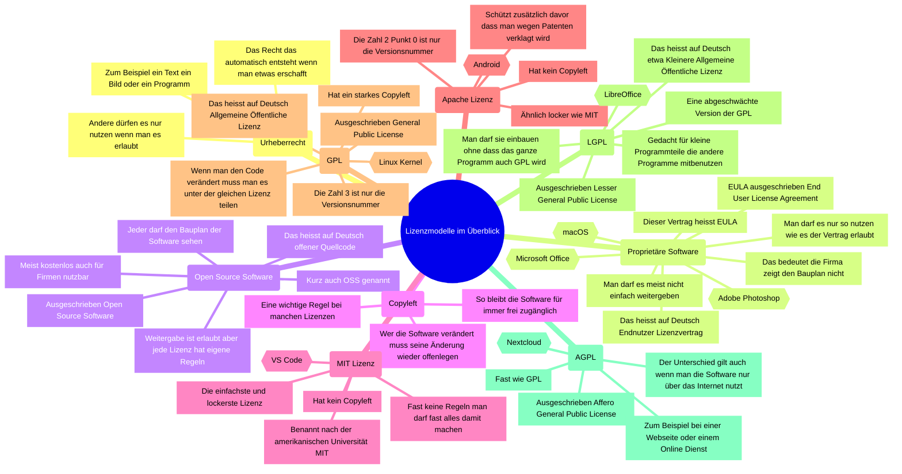
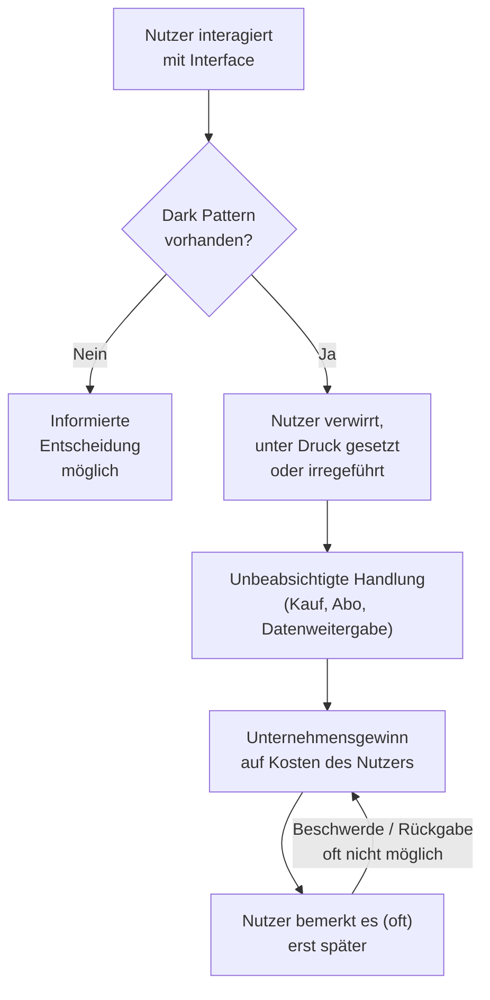

# M231 Lernjournal
### Ylli Uka
### PE26a
### Tag 4
### 07.09.26
**Mein LB1-Ergebnis:** 7.04 / 10.00 Punkte (in nur 2.5 Minuten)

---

## Was wir heute gelernt haben 

*   **Lizenzen & Urheberrecht:** Wer Code schreibt oder Fotos macht, bestimmt die Regeln. **Proprietär** (wie Windows) kostet meistens und der Code bleibt geheim . **Open Source** (OSS) ist gratis und jeder darf den Code sehen und anpassen.
*   **Tracking & Fingerprinting:** Webseiten spionieren uns voll aus [4]. Nicht nur mit Cookies, sondern auch mit **Fingerprinting** – die checken deine Auflösung, Schriftarten und Co. ab, um dich ohne Cookies wiederzuerkennen.
*   **Dark Patterns:** Das sind fiese Design-Tricks auf Webseiten, die uns austricksen wollen . Zum Beispiel, um uns heimlich Geld aus der Tasche zu ziehen oder uns Abos anzudrehen .

---

## Gelöste Aufgaben

### 1. Lizenzen zuordnen [10]
*   Schulprojekt (frei für alle, mit Namensnennung) -> **CC BY** 
*   Firma teilt Code (will Änderungen nicht zwingend zurück) -> **MIT** 
*   Fotograf teilt Bilder (kein Kommerz, keine Bearbeitung) -> **CC BY-NC-ND** 
*   Code-Bibliothek für eigene Kauf-Software -> **LGPL** 

### 2. Mein Fingerprint-Test (Cover Your Tracks) 
Ich habe meinen Browser getestet:
*   **Ad-Blocker:** Läuft, blockiert alles!
*   **Fingerprint-Schutz:** Richtig stabil, weil mein Browser den Fingerprint ständig **zufällig verändert** (randomisiert).
*   **Infos:** Hat trotzdem noch **18.3 Bits** an Infos rausgegeben (wegen Zeitzone, Sprache etc. – das kann man fast nicht blockieren).

### 3. Dark Patterns auf echten Webseiten gefunden 

*   **MediaMarkt (PC-Suche):**
    *   *Trick:* **Disguised Ads** (Getarnte Werbung) & **Misdirection** (Ablenkung) .
    *   *Warum:* Das erste Produkt ist eigentlich nur Werbung ("Gesponsert"), sieht aber exakt so aus wie ein normales Suchergebnis . Man übersieht das "Gesponsert" voll, weil daneben ein fetter rote Rabatt-Sticker (**-31%**) einen voll ablenkt.
*   **Galaxus (Sofa-Suche):**
    *   *Trick:* **Urgency / Scarcity** (Künstlicher Stress) .
    *   *Warum:* Da steht fett in Orange **"nur noch 1 Stück im Sale"** . Das macht einem voll Druck im Kopf, damit man schnell zuschlägt, ohne vorher woanders die Preise zu vergleichen .

---

## Was ich heute persönlich gelernt habe (Mein Fazit)

*   **Ich bin jetzt schlauer beim Shoppen:** Ich weiss jetzt, dass diese "Nur noch 1 Stück"-Meldungen oft nur Tricks sind Ich lass mich da nicht mehr stressen.
*   **Werbung wird immer fieser getarnt:** Dass sich Werbung so krass als echtes Suchergebnis tarnt, ist echt unverschämt Da muss man echt zweimal hinschauen.
*   **Man ist nie ganz unsichtbar im Netz:** Selbst mit guten Blockern schickt der Browser wegen Zeitzone und Co. immer noch kleine Infos mit  Aber immerhin erschweren wir es den Trackern maximal!
  

*   ## Bilder/Inhalt:

## Dark Patterns

Dark Patterns sind **Gestaltungstricks in Benutzeroberflächen**, die Nutzer zu einer Handlung verleiten, die sie nicht wollten oder beabsichtigt hätten.

### Wie Dark Patterns Entscheidungen manipulieren

