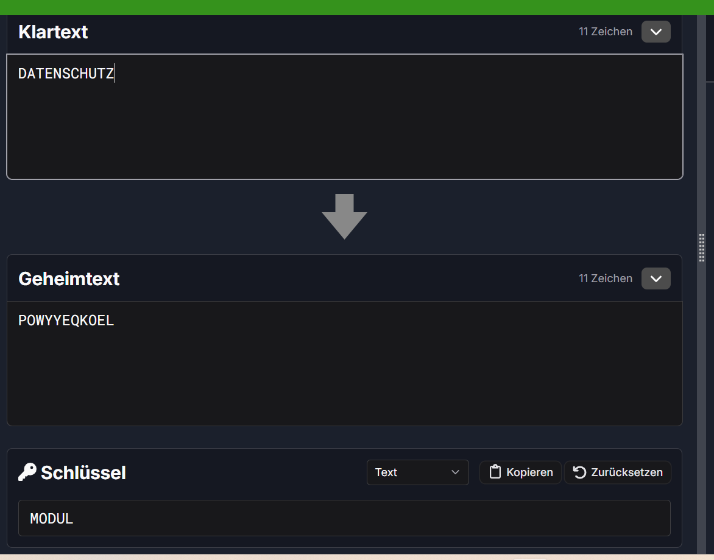

# M231 Lernjournal

### Ylli Uka

### PE26a

### Tag 6

### 28.09.26
---
 

  

Block: Checklisten Datenschutzbeauftragter 
  

**Thema:** Webtracking & Datenschutz auf Websites  
**Quelle:** [datenschutz.ch - Webtracking verhindern](https://www.datenschutz.ch/meine-daten-schuetzen/webtracking-verhindern)

---

### Checkliste 1: Website-Datenschutz & Cookie-Handling (Eigene Nutzung)

| # | Prüfpunkt | Einschätzung | Kommentar / Massnahme |
|---|---|---|---|
| 1 | **Einwilligung (Consent-Banner)**: Werden Tracking-Cookies abgelehnt? | Erfüllt | Cookies werden zu 90 % konsequent abgelehnt(manuell); Brave Shields blockiert viele Banner direkt. |
| 2 | **Transparenz in Datenschutzerklärung**: Werden genutzte Dienste geprüft? | Teilweise | Auf besuchten Seiten wird die Datenschutzerklärung bei Bedarf stichprobenartig auf Tracking-Dienste geprüft. |
| 3 | **IP-Anonymisierung & Schutz**: Wird die IP-Adresse geschützt? | Erfüllt | Brave Shields und Adblocker verhindern direkte Anfragen an bekannte Tracking-Server. |
| 4 | **Do Not Track (DNT) / GPC**: Wird das Signal zur Nicht-Nachverfolgung gesendet? | Erfüllt | Brave sendet automatisch Signale wie Global Privacy Control (GPC) / DNT an Webseiten. |
| 5 | **Drittlandübermittlung**: Werden Datenabflüsse in Drittstaaten minimiert? | Erfüllt | Durch das Blockieren von US-Trackern (z. B. Google Analytics) wird der ungewollte Datenabfluss verhindert. |

---

 
### Checkliste 2: Technische Schutzmassnahmen (Konkretes Setup)

| # | Prüfpunkt | Einschätzung | Kommentar / Massnahme |
|---|---|---|---|
| 1 | **Deaktivierung von Drittanbieter-Cookies**: Sind Third-Party-Cookies blockiert? | Erfüllt | Der Brave Browser blockiert Third-Party-Cookies standardmässig und konsequent. |
| 2 | **Einsatz datenschutzfreundlicher Alternativen**: Werden sichere Tools genutzt? | Erfüllt | Brave Browser sowie 1Password / Proton Pass für sicheres Passwort-Management im Einsatz. |
| 3 | **Skript- und Tracker-Blockierung**: Werden Fingerprinting & Skripte blockiert? | Erfüllt | Integrierter Adblocker & Brave Shields blockieren Werbe-Skripte und Tracker automatisch. |
| 4 | **Sichere Passwort- & Sitzungsverwaltung**: Werden Zugangsdaten geschützt? | Erfüllt | Verwenden von Passwort-Managern (1Password / Proton Pass) schützt vor Phishing und schwachen Passwörtern. |
| 5 | **Isolierung von Nutzungskontexten**: Werden Sitzungsdaten getrennt? | Erfüllt | Brave isoliert Storage und Cookies pro Domain (Ephemeral Storage / Fingerprinting Protection). |
---

### Aha-Moment:
Wie krass viele digitale Spuren man beim ganz normalen Surfen hinterlässt, ohne es überhaupt zu merken, aber gleichzeitig, wie **einfach** man sich davor schützen kann. Man muss absolut kein IT-Profi sein und oft reichen schon ein paar gezielte Einstellungen im Browser aus.

### Was ich gelernt habe:
* **Schutz ist eine Kombination:** Es reicht nicht, nur gelegentlich Cookie-Banner wegzuklicken. Wirklich effektiv ist das Zusammenspiel aus eigenem Verhalten (z. B. Logouts nach der Nutzung), richtigen Browser-Einstellungen (Drittanbieter-Cookies blockieren) und passenden Schutz-Tools.
* **Automatische Helfer nutzen:** Ein datenschutzorientierter Browser (wie Brave) oder gute Add-ons nehmen einem 90 % der Arbeit ab und blockieren Tracker ganz automatisch im Hintergrund.
* **Gewohnheiten anpassen:** Schon kleine Änderungen wie die Nutzung von alternativen Suchmaschinen (DuckDuckGo/Startpage) oder Passwort-Managern (1Password/Proton Pass) bringen extrem viel Schutz mit sehr wenig Aufwand.
* 
---

 

Vigenère-Chiffre mit Cryptool.org</b>

### Vigenère-Verschlüsselung (Praxis-Test)
* **Funktionsweise:** Im Gegensatz zur Caesar-Chiffre wird kein fester Zahlenwert, sondern ein **Schlüsselwort (nur aus Buchstaben)** genutzt.
* **Durchführung auf cryptool.org:**
  * **Klartext:** `DATENSCHUTZ`
  * **Schlüssel:** `MODUL`
  * **Geheimtext:** `POWYYEQKOEL`

### Was ich bei Vigenère gelernt habe
* **Polyalphabetische Verschlüsselung:** Derselbe Klartext-Buchstabe wird je nach Position im Schlüsselwort zu unterschiedlichen Geheimtext-Buchstaben verschoben.
* **Schutz vor einfacher Häufigkeitsanalyse:** Da Buchstaben nicht immer gleich ersetzt werden, verwischen die typischen Buchstaben-Muster einer Sprache.

 KI-Werkstatt : Caesar-Häufigkeitsanalyse</b>

### Caesar-Code knacken mit Häufigkeitsanalyse
* **Rolle der KI:** Generatorin des Chiffrats (Schlüssel vorab geheim).
* **Geheimtext:** `KPL KHALUZPJOLYOLPA PZA PT TVKBS ZLOY DPJOAPN`
* **Analyse-Schritte:**
  * Buchstabenzählung: `P` (7x) und `L` (3x) kommen am häufigsten vor.
  * Anwendung des Merkworts **ENISRAT** (Annahme: Der häufigste Buchstabe im Deutschen ist **E**).
  * Die Annahme `L` = `E` ergibt eine Verschiebung von 7 Stellen im Alphabet.
* **Ergebnis:**
  * **Schlüssel:** `7`
  * **Klartext:** `DIE DATENSICHERHEIT IST IM MODUL SEHR WICHTIG`

### Was ich bei der Caesar-Häufigkeitsanalyse gelernt habe
* **Unzulänglichkeit von Caesar:** Monoalphabetische Verfahren sind sehr unsicher, da die Sprachstatistik (z. B. **ENISRAT** im Deutschen) im Geheimtext vollständig erhalten bleibt.
* **Schnelle Verifikation:** Kurze Häufigkeitswörter (wie `KPL` → `DIE` oder `PZA` → `IST`) verraten und bestätigen den Schlüssel innerhalb von Sekunden.

## Gesamtfazit & Lernerfolg – Tag 06

### Zusammenfassung aller Blöcke
Im heutigen Unterricht wurden alle Blöcke zu **Datenschutz-Audits** und **symmetrischer Verschlüsselung** erfolgreich durchgearbeitet:

1. **Datenschutz-Checklisten & Webtracking (LB3-Auftrag):** 
   Beim Ausfüllen der zwei DSB-Checklisten wurde das eigene Nutzungsverhalten analysiert. Es hat sich gezeigt, dass man bereits mit einfachen Browser-Einstellungen (z. B. Brave Shields, Drittanbieter-Cookies blockieren) und passenden Tools (Passwort-Manager wie Proton Pass / 1Password) über 90 % der ungewollten Datenabflüsse automatisch stoppt.

2. **Historische symmetrische Verfahren:**
   * **Caesar-Chiffre & ROT13:** Einfache Verschiebung um einen festen Zahlenwert. Da das Verfahren monoalphabetisch ist, bleibt die deutsche Buchstabenstatistik (Merkwort **ENISRAT**) vollständig erhalten und macht den Code anfällig für Angriffe.
   * **Vigenère-Chiffre (Cryptool.org):** Nutzung eines variablen Schlüsselworts (z. B. `MODUL`). Durch die polyalphabetische Verschlüsselung ändern sich die Verschiebungsabstände pro Buchstabe, was das einfache Abzählen von Buchstaben erschwert.

3. **KI-Werkstatt 4 (Praktisches Knacken):**
   Ein von der KI generierter Geheimtext wurde von Hand mittels Häufigkeitsanalyse analysiert und mit Hilfe von **ENISRAT** erfolgreich entschlüsselt (`KPL KHALUZPJOLYOLPA PZA PT TVKBS ZLOY DPJOAPN` → *DIE DATENSICHERHEIT IST IM MODUL SEHR WICHTIG*, Schlüssel = 7).

### Persönliches Fazit
Alle Aufgaben und Blöcke von Tag 06 sind nun vollständig verstanden und gelöst. Die Mischung aus praktischen Datenschutz-Audits und den kryptographischen Hand-Übungen hat anschaulich gezeigt, wie Datensicherheit im Alltag funktioniert und warum moderne Verschlüsselungsverfahren (wie AES) historische Chiffren abgelöst haben.
