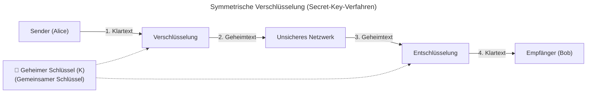
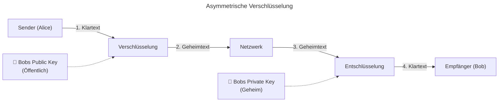

# M231 Lernjournal

### Ylli Uka

### PE26a

### Tag 7

### 19.10.26
---

## Verschlüsselungsverfahren

```mermaid
---
title: Symmetrische Verschlüsselung (Secret-Key-Verfahren)
---
flowchart LR
    A["Sender (Alice)"] -- "1. Klartext" --> V["Verschlüsselung"]
    K["🔑 Geheimer Schlüssel (K)\n(Gemeinsamer Schlüssel)"] -.-> V
    V -- "2. Geheimtext" --> N["Unsicheres Netzwerk"]
    N -- "3. Geheimtext" --> E["Entschlüsselung"]
    K -.-> E
    E -- "4. Klartext" --> B["Empfänger (Bob)"]
```

```mermaid
---
title: Asymmetrische Verschlüsselung
---
flowchart LR
    A["Sender (Alice)"] -- "1. Klartext" --> V["Verschlüsselung"]
    PUB["🔑 Bobs Public Key\n(Öffentlich)"] -.-> V
    V -- "2. Geheimtext" --> N["Netzwerk"]
    N -- "3. Geheimtext" --> E["Entschlüsselung"]
    PRIV["🔑 Bobs Private Key\n(Geheim)"] -.-> E
    E -- "4. Klartext" --> B["Empfänger (Bob)"]
```

