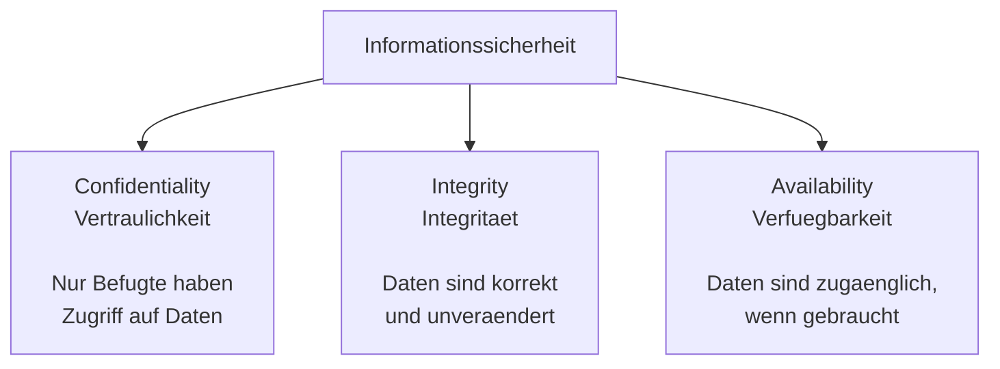
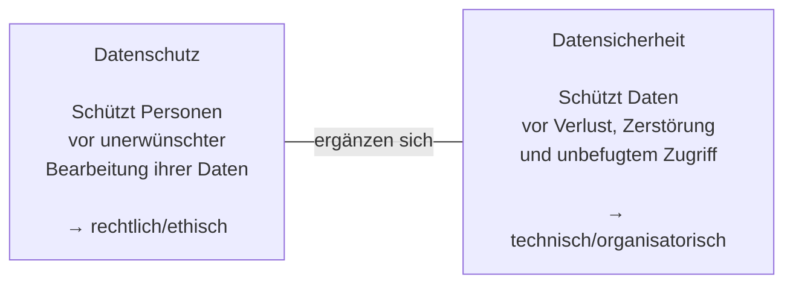
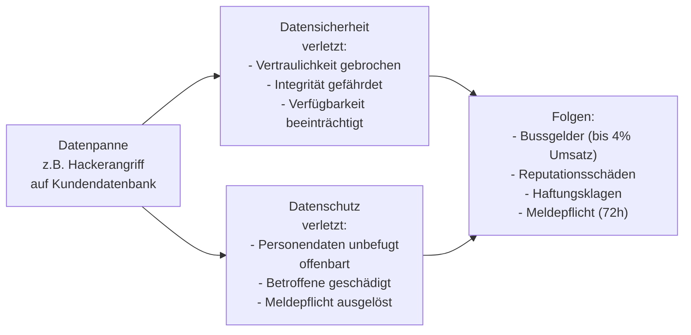

# Tag 03 - Lernjounal

  

	Block: CIA-Triade – Schutzziele der Informationssicherheit (~40')
  

## Die CIA-Triade

Bevor wir Datenschutz und Datensicherheit einander gegenüberstellen, brauchen wir eine gemeinsame Basis: die drei klassischen Schutzziele der Informationssicherheit.

| Ziel | Bedeutung | Beispiel für eine Verletzung |
|---|---|---|
| **Confidentiality** (Vertraulichkeit) | Nur befugte Personen haben Zugriff auf Daten | Ein Mitarbeiter liest Kundendaten ohne dienstlichen Grund |
| **Integrity** (Integrität) | Daten sind korrekt und unverändert | Eine Rechnung wird unbemerkt manipuliert |
| **Availability** (Verfügbarkeit) | Daten/Systeme sind bei Bedarf zugänglich | Ein Server ist wegen eines Angriffs nicht erreichbar |

> **Merksatz:** Die CIA-Triade beschreibt, *was* Datensicherheit technisch erreichen will. Sie ist die technische Grundlage, auf der Datenschutz – der rechtliche Schutz von Personendaten – aufbaut. Dazu gleich mehr im nächsten Block.

*(Vertiefung – reale Fälle, Risikomanagement und technische Massnahmen zu CIA folgen an Tag 8.)*

---

### Kurzübung: Welches CIA-Ziel ist betroffen?

Ordnen Sie jede Situation dem passenden CIA-Ziel zu (Mehrfachnennung möglich).

| Nr. | Situation | Betroffenes CIA-Ziel |
|---|---|---|
| 1 | Ein Ransomware-Angriff verschlüsselt alle Dateien eines Spitals. | |
| 2 | Ein Praktikant liest heimlich Personalakten von Kolleg:innen. | |
| 3 | Auf einer Webseite werden Preise durch eine Sicherheitslücke unbemerkt verändert. | |
| 4 | Ein DDoS-Angriff legt einen Online-Shop für Stunden lahm. | |

> Sozialform: Einzelarbeit → Plenum
> Dauer: 10min

Bearbeiten Sie die Tabelle zunächst allein. Im Plenum werden die Zuordnungen kurz besprochen und begründet.

  

	Block: Datenschutz vs. Datensicherheit (~45')
  

## Datenschutz und Datensicherheit – wo ist der Unterschied?

| | Datenschutz | Datensicherheit |
|---|---|---|
| **Ziel** | Persönlichkeitsrechte schützen | Verfügbarkeit, Integrität, Vertraulichkeit sicherstellen |
| **Regelung durch** | Gesetze (DSG, DSGVO) | Technische & organisatorische Massnahmen |
| **Beispiel** | Keine Weitergabe von Kundendaten ohne Einwilligung | Datenverschlüsselung, Backup, Zugriffsschutz |
| **Verantwortlich** | Datenschutzbeauftragter, alle Mitarbeitenden | IT-Abteilung, Systemadministratoren |

> **Merksatz:** Datensicherheit ist eine *Voraussetzung* für Datenschutz. Ohne sichere Systeme kann Datenschutz nicht gewährleistet werden.

---

### Wie eine Datenpanne beide Bereiche betrifft

---

### Think-Pair-Share: Klassifizieren Sie die Situation

Ordnen Sie jede Situation einer Kategorie zu: **Datenschutz** / **Datensicherheit** / **Beides** / **Keines**

| Nr. | Situation | Ihre Einschätzung | Begründung |
|---|---|---|---|
| 1 | Ein Mitarbeiter notiert Passwörter auf einem Post-it am Monitor. | | |
| 2 | Eine Firma gibt Mitarbeiterdaten ohne Einwilligung an Headhunter weiter. | | |
| 3 | Ein Server wird nicht regelmässig gesichert (kein Backup). | | |
| 4 | Eine App fragt beim Signup nach Geburtsdatum, braucht es aber nicht. | | |
| 5 | Die Firewall eines Unternehmens ist falsch konfiguriert und lässt Angriffe durch. | | |

**Think:**
> Sozialform: Einzelarbeit
> Dauer: 5min

Bearbeiten Sie die Tabelle zunächst allein und still – ohne sich mit anderen abzusprechen.

**Pair:**
> Sozialform: Partnerarbeit
> Dauer: 8min

Vergleichen Sie Ihre Einschätzungen mit Ihrer Sitznachbarin / Ihrem Sitznachbarn. Wo sind Sie unterschiedlicher Meinung – und warum?

**Share:**
> Sozialform: Plenum
> Dauer: 7min

Auflösung im Plenum: Reihum wird jede Situation kurz besprochen.

---

### Diskussionsaufgabe

> Sozialform: Plenum
> Dauer: 10min

Ein Krankenhaus speichert Patientendaten unverschlüsselt auf einem freigegebenen Netzlaufwerk.
- Welches Prinzip wird verletzt – Datenschutz, Datensicherheit oder beides?
- Welche Konsequenzen können entstehen?

  

