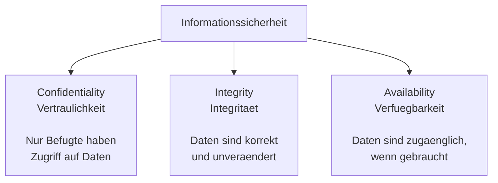

# M231 Lernjournal
### Ylli Uka
### PE26a
 
### 24.08.26
---
 

 
---
 
 
| Nr. | Situation | Betroffenes CIA-Ziel |
| :--- | :--- | :--- |
| **1** | Ein Ransomware-Angriff verschlüsselt alle Dateien eines Spitals. |Verfügbarkeit|
| **2** | Ein Praktikant liest heimlich Personalakten von Kolleg:innen. |Vertraulichkeit |
| **3** | Auf einer Webseite werden Preise durch eine Sicherheitslücke unbemerkt verändert. |Integrität |
| **4** | Ein DDoS-Angriff legt einen Online-Shop für Stunden lahm. | Verfügbarkeit|
 
 
---
 
 
| Nr. | Situation | Ihre Einschätzung | Begründung |
| :--- | :--- | :--- | :--- |
| **1** | Ein Mitarbeiter notiert Passwörter auf einem Post-it am Monitor. | **Datensicherheit** | Das Passwort liegt offen rum. Jeder kann sich einfach einloggen. |
| **2** | Eine Firma gibt Mitarbeiterdaten ohne Einwilligung an Headhunter weiter. | **Datenschutz** | Private Daten werden einfach ohne Erlaubnis weitergegeben. |
| **3** | Ein Server wird nicht regelmässig gesichert (kein Backup). | **Datensicherheit** | Ohne Backup sind die Daten bei einem Absturz komplett weg. |
| **4** | Eine App fragt beim Signup nach Geburtsdatum, braucht es aber nicht. | **Datenschutz** | Unnötige Datenabfrage verstösst gegen das Prinzip der Datenminimierung. |
| **5** | Die Firewall eines Unternehmens ist falsch konfiguriert und lässt Angriffe durch. | **Datensicherheit** | Ein technischer Fehler, der das Netzwerk ungeschützt lässt. |
